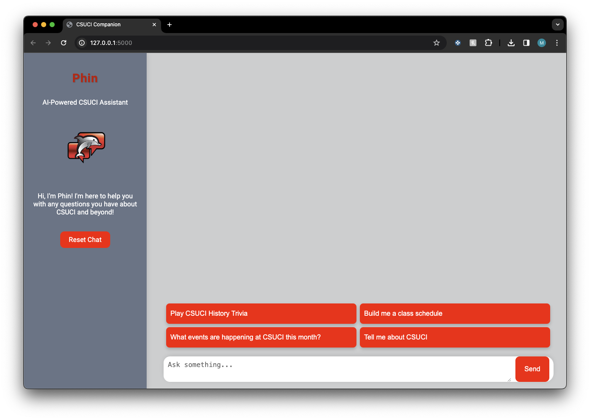
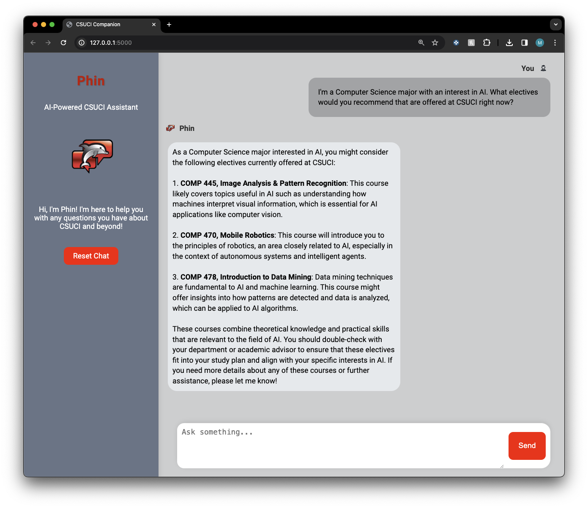
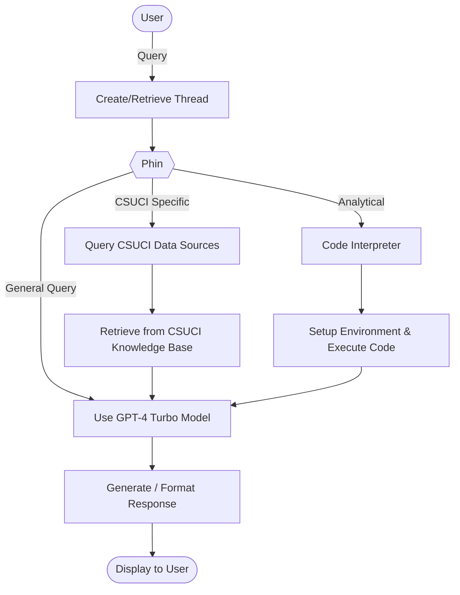
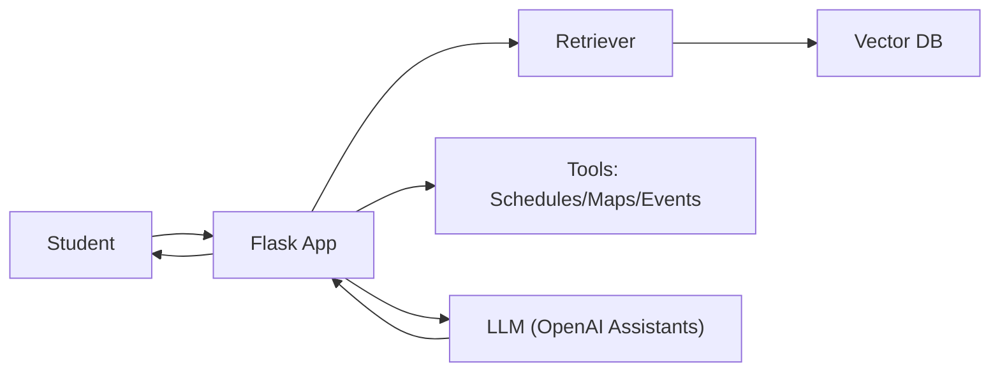

# *Phin*: The CSUCI Companion 🎓

<p align="center">
  <a href="https://phin.cikeys.com/">
  </a>
  <a href="#quickstart">
    
  </a>
</p>

Welcome to the CSUCI Companion, affectionately dubbed Phin (mascot), a Retrieval-Augmented Generative AI Assistant built to help students at California State University Channel Islands (CSUCI) seamlessly plan their academic journey. Leveraging the power of OpenAI's Assistant API and GPT-4.0 turbo, Phin offers tailored course recommendations, optimized scheduling, and a plethora of academic resources, all accessible through a natural language interface.

## Features 🐬
* **Course recommendations** tailored to your major and goals
* **Schedule optimization** to balance classes with constraints
* **CSUCI integration** for course availability & prerequisites
* **Natural interaction**: conversational Q&A for campus info


## Website

<p align="center">
  <!-- Row 1: single image -->
  
  <br/>
  <!-- Row 2: two images side by side -->
  
  &nbsp;&nbsp;
  
</p>


## Architecture





## Built With 🛠️
**Flask** · **LangChain** · **OpenAI Assistants API** · custom CSUCI data (classes, events, clubs)
* Flask — web framework: https://flask.palletsprojects.com/
* LangChain — orchestration: https://python.langchain.com/
* OpenAI Assistants — tools/retrieval/functions: https://platform.openai.com/docs/assistants/overview

## Quickstart
Prerequisites:
* Python 3.10+
* An OpenAI API key
 
To start the application locally:

```bash
# 1) Create & activate a virtual env
python -m venv .venv
source .venv/bin/activate

# 2) Install libraries
pip install -r requirements.txt

# 3) Configure your key
cp .env.example .env
# edit .env and set: OPENAI_API_KEY=...

# 4) Run
flask --app app run --port 8000
# visit http://localhost:8000
```

## Environment

| Variable       | Required | Example       | Notes                      |
|----------------|:--------:|---------------|----------------------------|
| `OPENAI_API_KEY` |   ✅    | `sk-...`      | API key for LLM            |
| `ASSISTANT_ID`   |   ✅    | `asst_...`    | OpenAI Assistant to run    |
| `SECRET_KEY`     |   ⚙️    | random string | Flask session security     |


ℹ️ Find out more about the development of this application on our [website](https://phin.cikeys.com/) 
 
