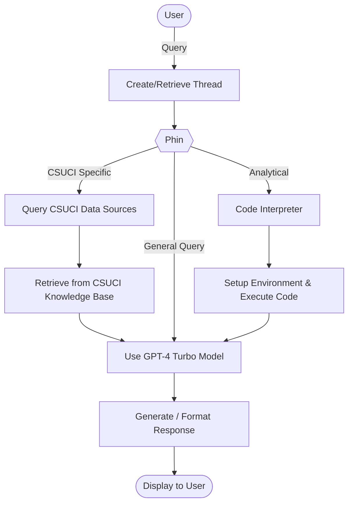

# *Phin*: The CSUCI Companion 🎓

<p align="center">
  <a href="https://phin.cikeys.com/">
  </a>
  <a href="#quickstart">
    
  </a>
</p>

Welcome to the CSUCI Companion, affectionately dubbed ~Dol~phin, a Retrieval-Augmented Generative AI Assistant built to help students at California State University Channel Islands (CSUCI) seamlessly plan their academic journey. Leveraging the power of OpenAI's Assistant API and GPT-4 Turbo, Phin offers tailored course recommendations, optimized scheduling, and a plethora of academic resources, all accessible through a natural language interface.

## Features 🐬
* **Course recommendations** tailored to your major and goals
* **Schedule optimization** to balance classes with personal commitments
* **CSUCI integration** for course availability & prerequisites
* **Natural interaction**: conversational Q&A for campus info


## Website

<p align="center">
  <!-- Row 1: single image -->
  
  <br/>
  <!-- Row 2: two images side by side -->
  
  &nbsp;&nbsp;
  
</p>


## Architecture



## Repository Structure
```text
CSUCI_Companion/
├── app.py                      # Flask app
├── requirements.txt
├── data-ingestion/
│   └── course-scraper/         # Scrapy crawler (Twisted async) → JSON feed
├── data/
│   └── samples/                # Sample outputs
├── static/                     # Frontend assets
├── images/  
└── README.md                   
```

## Built With 🛠️
**Flask** · **LangChain** · **OpenAI Assistants API** · custom CSUCI data (classes, events, clubs)
* Flask — web framework: https://flask.palletsprojects.com/
* LangChain — orchestration: https://python.langchain.com/
* OpenAI Assistants — tools/retrieval/functions: https://platform.openai.com/docs/assistants/overview

### Data Ingestion (Course Catalog Scraper)
Phin uses a Python Scrapy-based crawler to ingest course catalog data.
The scraper traverses subject and course hierarchies asynchronously using
Scrapy + Twisted, exporting structured JSON consumed by the downstream indexing and 
retrieval components of the RAG pipeline.

The crawler is designed to be refreshable each term with minimal changes.
Sample output schema: `data/samples/sample_ouput.json`.
See [`data-ingestion/course-scraper`](data-ingestion/course-scraper) for more scraper details.

## Quickstart
Prerequisites:
* Python 3.10+
* An OpenAI API key and Assistant ID

To start the application locally:

```bash
# 1) Create & activate a virtual env
python -m venv .venv
source .venv/bin/activate

# 2) Install libraries
pip install -r requirements.txt

# 3) Add your keys (secret.py is gitignored)
cat > secret.py <<'PY'
api_key = "sk-..."
assistant_id = "asst_..."
secret_key = "change-me"
PY

# 4) Run
flask --app app run --port 8000
# visit http://localhost:8000
```

## Environment

| Variable       | Required | Example       | Notes                      |
|----------------|:--------:|---------------|----------------------------|
| `api_key` |   ✅    | `sk-...`      | API key for LLM (in `secret.py`)     |
| `assistant_id`   |   ✅    | `asst_...`    | OpenAI Assistant to run (in `secret.py`)   |
| `secret_key`     |   ⚙️    | random string | Flask session security (in `secret.py`)    |


#### ℹ️ Find out more about the development of this application on our [website](https://phin.cikeys.com/) 
 
